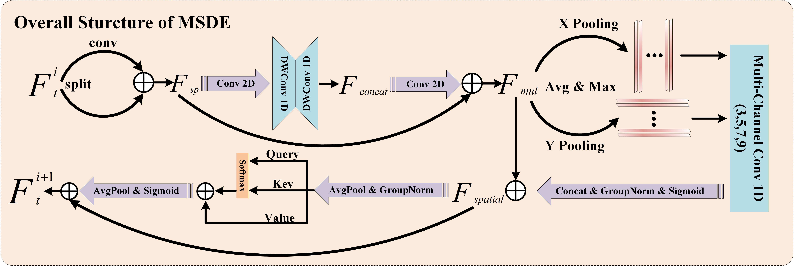

# Shape Feature Preservation Network for Building Change Detection

This repo is the official implementation for Shape Feature Preservation Network for Building Change Detection

## Architecture


## MSDE



## Prerequisites

This environment is mainly based on python=3.12 with CUDA=12.6

```shell
conda create -n SFPN python=3.12
conda activate SFPN
pip install -r requirements.txt
```

## Dataset

We use the [WHU-CD](https://gpcv.whu.edu.cn/data/building_dataset.html) and [SYSU-CD](https://github.com/liumency/SYSU-CD) for bitemporal satellite images.

**Folder structure**:
```
dataset/
├── train/
│ ├── t1/
│ ├── t2/
│ ├── t1_label/
│ ├── t2_label/
│ └── change_label/
├── val/
└── test/
```


## Parameters

All the parameters are in path_hyperparameter.py, which can make users change it easily.

## Credits

The code of this repository partly relies on [SGSLN](https://github.com/NJU-LHRS/offical-SGSLN), I would like to show my sincere gratitude to authors of them.


